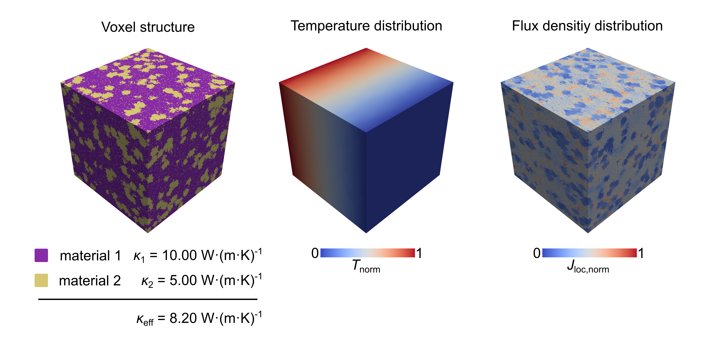

# `RNpy`

A python tool for running resistor network simulations based on voxel structures

## Example results
<p align="center">
  
</p>

## System requirements
- NumPy
- Matplotlib
- Numba
- pyevtk
- pandas
- CuPy

## Installation & Updates
1) Create a conda environment and activate it
```bash
conda create -n rnpy
conda activate rnpy
```
2) Install `RNpy` using the following command:
```bash
conda install -c l-ketter rnpy -c conda-forge
```
3) To update `RNpy` to the newest version run
```bash
conda update -c l-ketter rnpy -c conda-forge
```

## How to cite?
If you use `RNpy` in your published work, please cite the publication below:

Ketter, L., Greb, N., Bernges, T., Zeier, W. G., Using resistor network models to predict the transport properties of solid-state battery composites. *Nat. Commun.* **16**, 1411 (2025). https://doi.org/10.1038/s41467-025-56514-5

## Example usage

In the first step, we will create a 3D microstructure using the `blobs3D` function from the `composites` module. The function generates a cubic microstructure, whereby the overall edge length in voxels is controlled by the `size` parameter. Voxel clusters, each containing a number of `sclust` voxels are inserted into a continuous medium until a volume fraction of `disp_volfrac` (volume fraction in %) is reached. The resulting NumPy array consists of 0s and 1s as entries, where 0 represents the continuous phase and 1 represents the dispersed phase.

**Note:**
1. Inserted clusters overlap.
2. The function sets the total number of clusters at the start. After all clusters are placed, any remaining difference to the target volume fraction (`disp_volfrac`) is filled with unclustered voxels.
```python
import rnpy.composites as comp
import rnpy.networksolver as nws
import rnpy.networkbuilder as nwb
import rnpy.utils as utils

voxel_struc = comp.blobs3D(
    size=20,
    disp_volfrac=50,
    sclust=10
)
```
Basic figures of small voxel structures can be made using the `compositefigure` function. However, for larger structures, the function becomes significantly slower. For such cases and for advanced visualizations it is recommended to convert the numpy array into a .vti and do visualizations using ParaView (`.vti` export via `utils.store_data()` is shown below).
Next, we will set up and run a resistor network. First, we create a `Network` object using the `NetworkBuilder`. We pass the 3D voxel structure together with `phase_conds`, a list where each entry corresponds to the conductivity value of the respective phase (i.e. the conductivity at index `i` is assigned to phase `i` in `voxel_struc`).
```python
builder = nwb.NetworkBuilder()
nw = builder.build(
    voxel_struc=voxel_struc,
    phase_conds=[3,5],
    use_gpu=False
)
```
Now we choose a solver for the network. Available solvers are `Jacobi()`, `SOR()`, `SORRedBlack()` and `CG()` and `COCG()`. We choose the SOR implementation in this example and iterate until either the cutoff residual `res_max` or the maximum iteration count `it_max` is reached. Progress information is printed every `it_log` iterations.
```python
solver = nws.SOR()
nw = solver.solve(
    nw,
    res_max=1e-9,
    it_max=1e6,
    it_log=50
)
```
Finally, we compute and store some interesting quantities from the solved network.
```python
print(f'k_eff = {nw.get_k_eff():.4f}') # effective conductivity
log = solver.get_log()                 # solver log
jloc = nw.get_j_mag()                  # local current density
u_center = nw.get_u_center()           # solution field
utils.store_data(
    data = [log, jloc, u_center, voxel_struc],
    names = ['log.csv', 'jloc.npy', 'u_center.npy', 'voxel_struc.vti'],
    dir_path = 'my_first_try'
)
```

